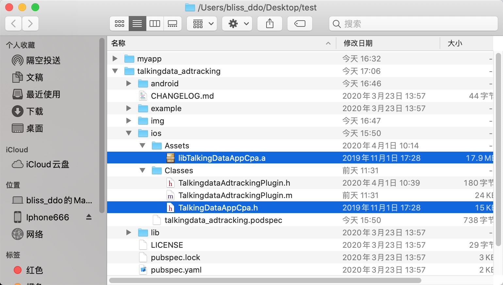
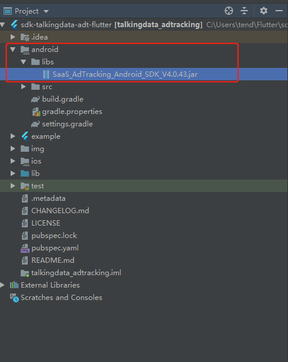
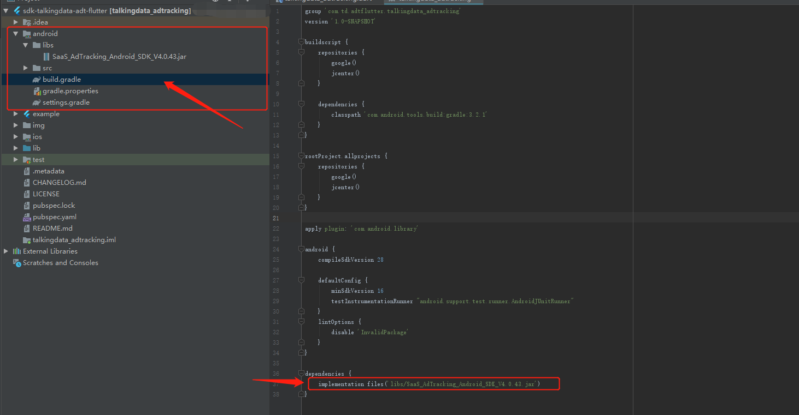
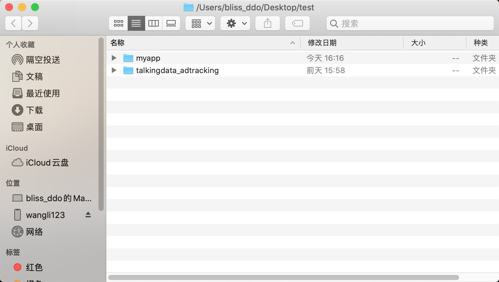

TalkingData-Flutter-SDK集成文档

TalkingDataFlutter SDK插件项目以及演示Demo。

<u>**‼️Demo中使用的libTalkingData.a仅为演示使用，请开发者申请最新的SDK包并进行相应替换。**</u>

<u>**请根据注意事项对封装层的代码进行删改，避免您在替换最新的SDK之后未勾选的功能报错**</u>

## 目录
* [快速开始](#快速开始)
* [集成示例](#集成示例)
* [注意事项](#注意事项)
* [接口说明](#接口说明)

## 快速开始

#### 试用Demo

```
git clone 本项目
cd talkingdata_adtracking/example
flutter run
```

#### 单独运行iOS Demo

```
git clone 本项目
cd talkingdata_adtracking/example
pod install // 如果之前安装过依赖，或者运行过flutter run，可以跳过此步骤
双击 Runner.xcworkspace 运行
```

## 请仔细阅读说明

### IOS

**项目文件夹中的静态库仅做演示使用，若用于生产环境，请到TalkingData官网申请最新版本的静态库，并且对本插件项目中的静态库和头文件进行替换**

需要替换的文件如下图所示:



### Android

**项目文件夹中的jar包仅做演示使用，若用于生产环境，请到TalkingData官网申请最新版本的jar包并进行替换，并且修改build.gradle中的jar包版本**

需要替换的文件如下图：



需要修改build.gradle中对应jar包的版本如下图：



Flutter共有三种方式集成插件，它们分别是：

1. Pub方式，插件开发者将插件发布到Flutter的统一插件开发平台，开发者远程集成
2. Git方式，开发者将插件放置于github或者gitlab上，远程集成
3. 本地集成，开发者将插件放在本地，方便开发者修改。

本插件项目采用第`3`种方式进行。

## 集成示例

这里是示例，请开发者按照示例步骤操作。

为了演示过程清晰，集成示例均在`test`文件夹下进行。

```shell
mkdir test
cd test
git clone 本项目 
flutter create myapp
```

此时`test`文件夹下包含：

- `myapp` 新创建的flutter App
- `talkingdata_adtrack` TalkingData的插件工程



编辑`myapp/pubspec.yaml`,在`dependencies` 和 `dev_dependencies` 添加对`talkingdata_adtracking`插件的的**本地依赖**：

```diff
dependencies:
  flutter:
    sdk: flutter
+ talkingdata_adtracking:
+   path: ../talkingdata_adtracking
  # The following adds the Cupertino Icons font to your application.
  # Use with the CupertinoIcons class for iOS style icons.
  cupertino_icons: ^0.1.2

dev_dependencies:
  flutter_test:
    sdk: flutter
+ talkingdata_adtracking:
+   path: ../talkingdata_adtracking   
    
```

1. 注意缩进
2. 注意路径，这里采用的相对路径，如果插件在其他位置，请注意修改插件路径为正确的相对路径或绝对路径。
3. 记得保存修改

在app项目里安装本地插件

```shell
cd myapp
flutter packages get
```

### IOS

安装相关依赖

```shell
cd myapp/ios
pod install
```

双击打开`myapp/ios/Runner.xcworkspace` 在 `AppDelegate.m` 中添加以下代码:

```diff
#include "AppDelegate.h"
#include "GeneratedPluginRegistrant.h"
+#import <talkingdata_adtracking/TalkingdataAdtrackingPlugin.h>

@implementation AppDelegate

- (BOOL)application:(UIApplication *)application
    didFinishLaunchingWithOptions:(NSDictionary *)launchOptions {
  [GeneratedPluginRegistrant registerWithRegistry:self];
  // Override point for customization after application launch.
+    [TalkingdataAdtrackingPlugin pluginSessionStart:@"YourAppID" withChannelId:@"YourChannel"];
  return [super application:application didFinishLaunchingWithOptions:launchOptions];
}

@end
```

打开`myapp/lib/main.dart` ，添加对插件包的引用:

```diff
import 'package:talkingdata_adtracking/talkingdata_adtracking.dart';
```

在Demo按钮的回调处添加测试代码:

```dart
TalkingdataAdtracking.onRegister("test"); //调用onRegister接口,参数为"test"
```

此时双击`Runner.xcworkspace`运行myapp.

项目运行点击按钮，可以在Xcode或者终端控制台，看到接口调动log输出。完成集成。

### Android

在`myapp/android`模块下您的`Application`类的`onCreate`方法中调用初始化代码。如果没有的话，您也可以在您的`MainActivity`的`onCreate`回调中调用相关的初始化代码

``` diff
+  import com.td.adtflutter.talkingdata_adtracking.TalkingdataAdtrackingPlugin;

     class MyApplication extends FlutterApplication{
       @Override
       public void onCreate() {
         super.onCreate();
+        TalkingdataAdtrackingPlugin.init(getApplicationContext(), "Your App ID", "Channel ID");
       }
   }
```

在`myapp/android`模块下的`AndroidManifest.xml `中添加以下权限：

``` diff
<!--?xml version="1.0" encoding="utf-8"?-->
<manifest ......>
+  <uses-permission android:name="android.permission.INTERNET" /><!-- 允许程序联网和发送统计数据的权限。-->
+  <uses-permission android:name="android.permission.ACCESS_NETWORK_STATE" /><!-- 允许应用检测网络连接状态，在网络异常状态下避免数据发送，节省流量和电量。-->
+  <uses-permission android:name="android.permission.READ_PHONE_STATE"  /><!-- 允许应用以只读的方式访问手机设备的信息，通过获取的信息来唯一标识用户。-->
+  <uses-permission android:name="android.permission.ACCESS_WIFI_STATE"  /><!-- 获取设备的MAC地址，同样用来标识唯一用户。-->
+  <uses-permission android:name="android.permission.WRITE_EXTERNAL_STORAGE"  /><!-- 用于保存设备信息，以及记录日志。-->
+  <uses-permission android:name="android.permission.GET_TASKS"  /><!-- (建议配置) 获取当前应用是否在显示应用，可以更精准的统计用户活跃-->
+  <uses-permission android:name="android.permission.ACCESS_FINE_LOCATION"  /><!-- (可选权限) 可通过GPS获取设备的位置信息，用来修正用户的地域分布数据，使报表数据更准确。-->
+  <uses-permission android:name="android.permission.ACCESS_COARSE_LOCATION"  /><!-- (可选权限) 用来获取该应用被使用的粗略位置信息。-->

  <application ......>
  <activity ......>
  ......
  </activity>
  ......
  </application>
</manifest>
```

打开`myapp/lib/main.dart` ，添加对插件包的引用:

```diff
import 'package:talkingdata_adtracking/talkingdata_adtracking.dart';
```

在您的dart文件中添加测试代码:

```dart
TalkingdataAdtracking.onRegister("test"); //调用onRegister接口,参数为"test"
```

在myapp的路径下执行`flutter run`，运行您的项目

## 注意事项

## <font color=#1E90FF>功能选择和代码删减</font>

当前的封装层代码包含了所有行业接口。在官网申请的SDK是部分功能的情况下，需要开发者根据[行业专属事件](#行业专属事件)中的事件对封装层的文件进行必要的删减。以免对应的接口不存在导致报错。需要删减的文件如下:

iOS:

`TalkingdataAdtrackingPlugin.m`

Android:

`TalkingdataAdtrackingPlugin.java`

Flutter:

`talkingdata_adtracking.dart`

举例:

在官网未勾选小说阅读行业。那么请对照上表，删除小说阅读行业对应的接口。这里以文章阅读接口作为举例:

删除`TalkingdataAdtrackingPlugin.m`的相关代码:

```
 NSString * account = [self checkArgument:call.arguments forKey:@"account" ofType:[NSString class]];
        NSString * book = [self checkArgument:call.arguments forKey:@"book" ofType:[NSString class]];
        NSNumber * begin = [self checkArgument:call.arguments forKey:@"begin" ofType:[NSNumber class]];
        NSNumber * duration = [self checkArgument:call.arguments forKey:@"duration" ofType:[NSNumber class]];
        [TalkingDataAppCpa onRead:account book:book begin:begin.longLongValue duration:duration.intValue];
```

删除`TalkingdataAdtrackingPlugin.java`的相关代码:

```
TalkingDataAppCpa.onRead(
                        (String) call.argument("account"),
                        (String) call.argument("book"),
                        callTransInt(call,"begin"),
                        callTransInt(call,"duration"));
```

删除`talkingdata_adtracking.dart`的相关代码:

```
  static Future<void> onRead(String account,String book ,int begin,int duration) async{
    return await _channel.invokeMethod('onRead', <String,dynamic>{
      'account': account,
      'book': book,
      'begin': begin,
      'duration': duration,
    });
  }
```

除去上述专属事件接口的删减之外，如果没有选择电商或者旅游行业，请参照`基础-搜索`的参数介绍，去掉对应上述删减文件中的相应参数

## 接口说明

## <font color=#1E90FF>基础-基础统计</font>

正确按照集成步骤集成完SDK之后，自动完成应用启动的统计。详情可以参考集成步骤。

## <font color=#1E90FF>基础-渠道统计</font>

### 1、用途和用法

给应用的安装包打入特殊的渠道标记，用户安装并使用后，就可以在报表中分不同渠道来源单独查询相应的数据。
在您为应用商店、下载站等分发渠道提供应用安装包时，可以加入渠道标记；在进行特别的活动时也可加入特殊渠道标记便于单独分析效果。

注意事项：
用户的渠道归属：每台设备仅记录到首次安装激活的渠道，同一用户在更替渠道包使用后不会重复计算新增，使用数据归入首次激活渠道。如果未添加渠道标记，用户将会归入为“未知渠道”。

### 2、集成方式说明

在初始化中写入渠道ID即可。

## <font color=#1E90FF>基础通用事件</font>

基础通用事件适用于**所有行业类型**的移动APP，包含注册、登录、唤醒、收藏、分享、签到打卡、添加支付信息、搜索。

## <font color=#1E90FF>基础-注册</font>

**接口名称**：getDeciveID

**说明**：获取设备ID

**参数**：无

**示例**：

```
String deviceID;
_setDeviceID() async{
  deviceID =  await TalkingdataAdtracking.getDeviceID();
  //Print deviceID or dosomething
  print(deviceID);
}
```

## <font color=#1E90FF>基础-注册</font>

**接口名称**：

```
onRegister(account);

onRegisterWithinvitationCode(account,invitationCode);
```


**说明**：注册接口用于记录用户在使用应用过程中的注册行为。建议在注册成功时调用此接口。

**参数**：

| 参数           | 类型   | 描述     | 是否必选 |
| :------------- | :----- | :------- | :------- |
| accountId      | string | 用户账号 | 是       |
| invitationCode | string | 邀请码   | 否       |

**示例**：

```
String account = "user01";
TalkingdataAdtracking.onRegister(account);

String account = "user01";
String invitationCode = "1001";               
TalkingdataAdtracking.onRegisterWithinvitationCode(account,invitationCode);
```


## <font color=#1E90FF>基础-登录</font>

**接口名称**：onLogin

**说明**：登录接口用于记录用户在使用应用过程中的登录行为。

**参数说明**

| 参数    | 类型   | 描述     | 是否必选 |
| ------- | ------ | -------- | -------- |
| account | String | 用户账号 | 是       |

**示例**：

```objc
String account = "user01";
TalkingdataAdtracking.onLogin(account);
```


## <font color=#1E90FF>基础-唤醒</font>

**接口名称**：onReceiveDeepLink

**说明**：在用户添加支付信息成功后调用。

**参数说明:**

| 参数 | 类型   | 描述                                                         | 是否必选 |
| :--- | :----- | :----------------------------------------------------------- | :------- |
| link | string | 唤起应用的link，支持英文、数字、符号，至多800位字符。需拼接campaignid，[拼接指南](http://doc.talkingdata.com/posts/904) | 是       |

**示例**：

```objc
String link = "https://www.talkingdata.com";
TalkingdataAdtracking.onReceiveDeepLink(link);
```


## <font color=#1E90FF>基础-收藏</font>

**接口名称**：onFavorite

**说明**：在用户进行收藏行为并完成收藏事件时调用。

**参数说明**

| 参数     | 类型   | 描述                                 | 是否必选 |
| -------- | ------ | ------------------------------------ | -------- |
| category | String | 收藏类别，支持中文、英文、数字、符号 | 否       |
| content  | String | 收藏内容，支持中文、英文、数字、符号 | 否       |

**示例：**

```objc
String category = "book";
String content = "GodFather";             
TalkingdataAdtracking.onFavorite(category,content);
```


## <font color=#1E90FF>基础-分享</font>

**接口名称**：onShare

**说明**：在用户帐号进行分享行为时调用。

**参数说明**

| 参数      | 类型   | 描述                                 | 是否必选 |
| --------- | ------ | ------------------------------------ | -------- |
| accountId | String | 用户账号ID，支持英文、数字、符号     | 否       |
| content   | String | 分享内容，支持中文、英文、数字、符号 | 否       |

**示例：**

```objc
String account = "user01";
String content = "best content"; 
TalkingdataAdtracking.onShare(account,content);
```


## <font color=#1E90FF>基础-签到打卡</font>

**接口名称**：onPunch

**说明**：在用户帐号进行签到打卡行为时调用。

**参数说明**

| 参数      | 类型   | 描述                             | 是否必选 |
| --------- | ------ | -------------------------------- | -------- |
| accountId | String | 用户账号ID，支持英文、数字、符号 | 否       |
| punchId   | String | 签到打卡ID，支持英文、数字、符号 | 否       |

**示例：**

```objc
String account = "user01";
String punchId = "punchId01";             
TalkingdataAdtracking.onPunch(account,punchId);
```


## <font color=#1E90FF>基础-添加支付信息</font>

**接口名称**：onCreateCard

**说明**：在用户添加支付信息成功后调用。

**参数说明:**

| 参数      | 类型   | 描述                                 | 是否必选 |
| :-------- | :----- | :----------------------------------- | :------- |
| accountId | string | 用户账号ID，支持英文、数字、符号     | 否       |
| method    | string | 支付方式，支持英文、数字、符号       | 否       |
| content   | string | 支付信息，支持中文、英文、数字、符号 | 否       |

**示例**：

```objc
String account = "user01";
String method = "WePay";
String content = "Game-Item-02";             
TalkingdataAdtracking.onCreateCard(account,method,content);
```


## <font color=#1E90FF>基础-搜索</font>

**接口名称**：onSearch

**说明**：在用户帐号进行应用内搜索行为时调用。

**参数说明**

| 参数   | 类型         | 描述         | 是否必选 |
| ------ | ------------ | ------------ | -------- |
| search | TDSearch对象 | 搜索事件属性 | 是       |

**TDSearch 说明：**

| 参数           | 类型   | 描述                                                 | 是否必选 |
| -------------- | ------ | ---------------------------------------------------- | -------- |
| category       | String | 搜索分类，支持英文、数字、符号                       | 否       |
| content        | String | 搜索内容，支持英文、数字、符号                       | 否       |
| itemId         | String | （电商类专用）商品Id，支持中文、英文、数字、符号     | 否       |
| itemLocationId | String | （电商类专用）商品位置，支持中文、英文、数字、符号   | 否       |
| destination    | String | （旅游类专用）目的地城市，支持中文、英文、数字、符号 | 否       |
| origin         | String | （旅游类专用）出发地城市，支持中文、英文、数字、符号 | 否       |
| startDate      | int    | （旅游类专用）起始时间戳（毫秒）                     | 否       |
| endDate        | int    | （旅游类专用）截止时间戳（毫秒）                     | 否       |

**示例：**

```objc
TDADTSearch search = TDADTSearch(
 category : "Book",
 content  : "Book's content",
 itemId : "item-001",
 itemLocationId : "itemLocationId-001",
 destination : "Beijing",
 origin : "ShangHai",
 startDate : 1586669180,
 endDate : 1587101180,
 );
 TalkingdataAdtracking.onSearch(search);
```

<span id="exclusive"/>

## <font color=#1E90FF>行业专属事件</font>

| 事件名称     | 电商零售 | 游戏娱乐 | 金融借贷 | 旅游出行 | 在线教育 | 小说阅读 | 其他行业 |
| ------------ | -------- | -------- | -------- | -------- | -------- | -------- | -------- |
| 联系         | √        | &nbsp;   | √        | √        | √        | &nbsp;   | &nbsp;   |
| 付费         | &nbsp;   | √        | &nbsp;   | √        | √        | √        | √        |
| 退单         | √        | &nbsp;   | √        | √        | √        | &nbsp;   | &nbsp;   |
| 预约         | &nbsp;   | &nbsp;   | √        | &nbsp;   | √        | &nbsp;   | &nbsp;   |
| 预订         | √        | &nbsp;   | &nbsp;   | √        | &nbsp;   | &nbsp;   | &nbsp;   |
| 查看商品     | √        | &nbsp;   | &nbsp;   | &nbsp;   | &nbsp;   | &nbsp;   | &nbsp;   |
| 添加购物车   | √        | &nbsp;   | &nbsp;   | &nbsp;   | &nbsp;   | &nbsp;   | &nbsp;   |
| 查看购物车   | √        | &nbsp;   | &nbsp;   | &nbsp;   | &nbsp;   | &nbsp;   | &nbsp;   |
| 订单         | √        | &nbsp;   | &nbsp;   | &nbsp;   | &nbsp;   | &nbsp;   | &nbsp;   |
| 支付订单     | √        | &nbsp;   | &nbsp;   | &nbsp;   | &nbsp;   | &nbsp;   | &nbsp;   |
| 授信         | &nbsp;   | &nbsp;   | √        | &nbsp;   | &nbsp;   | &nbsp;   | &nbsp;   |
| 交易         | &nbsp;   | &nbsp;   | √        | &nbsp;   | &nbsp;   | &nbsp;   | &nbsp;   |
| 创建角色     | &nbsp;   | √        | &nbsp;   | &nbsp;   | &nbsp;   | &nbsp;   | &nbsp;   |
| 通过关卡     | &nbsp;   | √        | &nbsp;   | &nbsp;   | &nbsp;   | &nbsp;   | &nbsp;   |
| 完成新手教程 | &nbsp;   | √        | &nbsp;   | &nbsp;   | &nbsp;   | &nbsp;   | &nbsp;   |
| 课程学习     | &nbsp;   | &nbsp;   | &nbsp;   | &nbsp;   | √        | &nbsp;   | &nbsp;   |
| 完成课程试听 | &nbsp;   | &nbsp;   | &nbsp;   | &nbsp;   | √        | &nbsp;   | &nbsp;   |
| 文章阅读     | &nbsp;   | &nbsp;   | &nbsp;   | &nbsp;   | &nbsp;   | √        | &nbsp;   |
| 完成免费阅读 | &nbsp;   | &nbsp;   | &nbsp;   | &nbsp;   | &nbsp;   | √        | &nbsp;   |
| 解锁成就     | &nbsp;   | √        | &nbsp;   | &nbsp;   | √        | &nbsp;   | &nbsp;   |
| 浏览详情     | &nbsp;   | &nbsp;   | √        | √        | &nbsp;   | &nbsp;   | √        |
| 完成试用体验 | √        | &nbsp;   | √        | √        | &nbsp;   | &nbsp;   | √        |
| 自定义事件   | √        | √        | √        | √        | √        | √        | √        |

## <font color=#1E90FF>专属-联系</font>

**接口名称**：onContact

**说明**：在用户联系商家或平台的时候调用 。

**参数说明**

| 参数    | 类型   | 描述                           | 是否必选 |
| ------- | ------ | ------------------------------ | -------- |
| account | String | 用户帐号，支持英文、数字、符号 | 否       |
| content | String | 联系内容，支持英文、数字、符号 | 否       |

**示例：**

```objc
String account = "user01";
String content = "MyContent";             
TalkingdataAdtracking.onContact(account,content);
```


## <font color=#1E90FF>专属-付费</font>

**接口名称**：

```
onPay1(account,orderId,amount,currencyType,payType);

onPay2(account,orderId,amount,currencyType,payType,order);

onPay3(account,orderId,amount,currencyType,payType,itemID,itemCount);
```


**说明**：在用户付费成功的时候调用。

**参数说明**

| 参数         | 类型       | 描述                                                         | 是否必选 |
| ------------ | ---------- | ------------------------------------------------------------ | -------- |
| account      | String     | 用户帐号，支持英文、数字、符号                               | 是       |
| orderId      | String     | 订单ID，最多64个字符，全局唯一，由开发者提供并维护（此ID很重要，如果不清楚集成时咨询客服）。用于唯一标识一次交易，以及后期系统之间对账使用；*如果多次充值成功的orderID重复，将只计算首次成功的数据，其他数据会认为重复数据丢弃。支持英文、数字、符号 | 是       |
| currencyType | String     | 请使用国际标准组织ISO 4217中规范的3位字母代码标记货币类型。支持英文。详见【重点问题解答-问题1】 | 是       |
| amount       | String     | 订单的实际支付金额，单位为所选货币的分。支持数字。比如:600分或100美分，币种以后面的currrencyType为标准。 | 否       |
| payType      | String     | 支付类型 例：appstore、支付宝、Alipay、微信等                | 否       |
| order        | TDADTOrder | 订单，详见【专属-订单】                                      | 否       |
| itemID       | String     | 商品ID，支持英文、数字、符号                                 | 否       |
| itemCount    | int        | 商品数量，支持数字                                           | 否       |

**示例：**

```objc
String account = "user-01";
String orderId = "oid001";
int amount = 12;
String currencyType = "CNY";
String payType = "AliPay";
TalkingdataAdtracking.onPay1(account,orderId,amount,currencyType,payType);

String account = "user-01";
String orderId = "oid001";
int amount = 12;
String currencyType = "CNY";
String payType = "AliPay";
TDADTOrder order = TDADTOrder(
orderID: 'orderID102',
totalPrice: 1,
currencyType: 'CNY',
);
order.addItem('testID', 'Food', 'apple', 22, 33);
TalkingdataAdtracking.onPay2(account,orderId,amount,currencyType,payType,order);

String account = "user-01";
String orderId = "oid001";
int amount = 12;
String currencyType = "CNY";
String payType = "AliPay";
String itemID = "item001";
int itemCount = 5;
TalkingdataAdtracking.onPay3(account,orderId,amount,currencyType,payType,itemID,itemCount);
```


## <font color=#1E90FF>专属-退单</font>

**接口名称**：onChargeBack

**说明**：在用户退单的时候调用 。

**参数说明**

| 参数    | 类型   | 描述                                 | 是否必选 |
| ------- | ------ | ------------------------------------ | -------- |
| account | String | 用户帐号，支持英文、数字、符号       | 否       |
| orderId | String | 订单ID，支持英文、数字、符号         | 否       |
| reason  | String | 退单原因，支持中文、英文、数字、符号 | 否       |
| type    | String | 退单类型，支持中文、英文、数字、符号 | 否       |

**示例：**

```objc
String account = "user01";
String orderId = "oid01";
String reason = "reason";
String type = "type01";
TalkingdataAdtracking.onChargeBack(account,orderId,reason,type);
```


## <font color=#1E90FF>专属-预约</font> 

**接口名称**：onReservation

**说明**：在用户帐号进行预约行为时调用。

**参数说明**

| 参数          | 类型   | 描述                                 | 是否必选 |
| ------------- | ------ | ------------------------------------ | -------- |
| account       | String | 用户账号ID，支持英文、数字、符号     | 否       |
| reservationId | String | 预约ID，支持中文、英文、数字、符号   | 否       |
| category      | String | 预约分类，支持中文、英文、数字、符号 | 否       |
| amount        | int    | 预约金，支持中文、英文、数字、符号   | 否       |
| term          | String | 预约信息，支持中文、英文、数字、符号 | 否       |

**示例：**

```objc
String account = "user01";
String reservationId = "100921";
String category = "hotel";
int amount = 1;
String term = "MyTerm";
TalkingdataAdtracking.onReservation(account,reservationId,category,amount,term);
```


## <font color=#1E90FF>专属-预订</font> 

**接口名称**：onBooking

**说明**：在用户帐号进行预订行为时调用。

**参数说明**

| 参数      | 类型   | 描述                                 | 是否必选 |
| --------- | ------ | ------------------------------------ | -------- |
| account   | String | 用户账号ID，支持英文、数字、符号     | 否       |
| bookingId | String | 预订ID，支持英文、数字、符号         | 否       |
| category  | String | 预订分类，支持中文、英文、数字、符号 | 否       |
| amount    | int    | 预订金，单位为所选货币的分           | 否       |
| term      | String | 预订内容，支持中文、英文、数字、符号 | 否       |

**示例：**

```objc
String account = "user01";
String bookId = "60018";
String category = "hotel";
int amount = 1;
String term = "MyTerm";
TalkingdataAdtracking.onBooking(account,bookId,category,amount,term);
```


## <font color=#1E90FF>专属-查看商品</font> 

**接口名称**：onViewItemWithCategory

**说明**：用户在浏览一个商品详情时调用。

**参数说明**

| 参数      | 类型   | 描述                                                         | 是否必选 |
| --------- | ------ | ------------------------------------------------------------ | -------- |
| category  | String | 商品类别，支持中文、英文、数字、符号                         | 否       |
| itemId    | String | 商品ID，支持英文、数字、符号                                 | 否       |
| name      | String | 商品名称，支持中文、英文、数字、符号                         | 否       |
| unitPrice | int    | 商品价格，单位为所选货币的分。比如:600分或100美分，币种以订单详情中的currrencyType为标准。 | 否       |

**示例：**

```objc
String category = "Book";
String itemId = "9112";
String name = "GodFather";
int unitPrice = 99;
TalkingdataAdtracking.onViewItemWithCategory(category,itemId,name,unitPrice);
```


## <font color=#1E90FF>专属-购物车</font> 

### 加入购物车

**接口名称**：onAddItemToShoppingCart

**说明**：用户在添加一个商品到购物车时调用

**参数说明**

| 参数      | 类型   | 描述                                                         | 是否必选 |
| --------- | ------ | ------------------------------------------------------------ | -------- |
| category  | String | 商品类别，支持中文、英文、数字、符号                         | 否       |
| itemId    | String | 商品ID，支持英文、数字、符号                                 | 否       |
| name      | String | 商品名称，支持中文、英文、数字、符号                         | 否       |
| unitPrice | int    | 商品价格，单位为所选货币的分。比如:600分或100美分，币种以订单详情中的currrencyType为标准。 | 否       |
| amount    | int    | 商品数量，支持数字                                           | 否       |

**示例：**

```objc
String category = "Book";
String itemId = "9112";
String name = "GodFather";
int unitPrice = 99;
int amount = 99;
TalkingdataAdtracking.onAddItemToShoppingCart(category,itemId,name,unitPrice,amount);
```

### 查看购物车

由3个接口组成

- 创建购物车
- 添加购物车详情
- 查看购物车详情

#### 创建购物车

**接口名称**：TDADTShoppingCart

**说明**：在调用 `onViewShoppingCart` 接口前调用以创建购物车信息

**示例：**

```objc
TDADTShoppingCart shoppingCart = TDADTShoppingCart();
```

#### 添加购物车详情

**接口名称**：addItem

**说明**：创建购物车信息后添加商品信息时调用

**参数说明**

| 参数      | 类型   | 描述                                                         | 是否必选 |
| --------- | ------ | ------------------------------------------------------------ | -------- |
| category  | String | 商品类别，支持中文、英文、数字、符号                         | 否       |
| itemId    | String | 商品ID，商品ID，支持英文、数字、符号                         | 否       |
| name      | String | 商品名称，支持中文、英文、数字、符号                         | 否       |
| unitPrice | int    | 商品价格，单位为所选货币的分。比如:600分或100美分，币种以订单详情中的currrencyType为标准。 | 否       |
| amount    | int    | 商品数量 ，支持数字                                          | 否       |

**示例：**

```objc
TDADTShoppingCart shoppingCart = TDADTShoppingCart();
shoppingCart.addItem('itemID331135516', 'Food', 'apple', 33, 11);
shoppingCart.addItem('itemID333103428', 'Food', 'banana', 777, 888);
```

#### 查看购物车详情

**接口名称**：onViewShoppingCart

**说明**：用户在浏览购物车内所有商品时调用

**参数说明**

| 参数         | 类型           | 描述                       | 是否必选 |
| ------------ | -------------- | -------------------------- | -------- |
| shoppingCart | TDShoppingCart | 购物车详情，详见创建购物车 | 是       |

**示例：**

```objc
TDADTShoppingCart shoppingCart = TDADTShoppingCart();
shoppingCart.addItem('itemID331135516', 'Food', 'apple', 33, 11);
shoppingCart.addItem('itemID333103428', 'Food', 'banana', 777, 888);
TalkingdataAdtracking.onViewShoppingCart(shoppingCart);
```


## <font color=#1E90FF>专属-订单</font>

由3个接口组成:

- 创建订单
- 添加订单详情
- 下单

### 创建订单

**接口名称**：TDADTOrder

**说明**：通过生成TDADTOrder对象来创建订单

**参数说明**

| 参数         | 类型   | 描述                                                         | 是否必选 |
| ------------ | ------ | ------------------------------------------------------------ | -------- |
| orderId      | String | 订单ID，最多64个字符，全局唯一，由开发者提供并维护（此ID很重要，如果不清楚集成时咨询客服）。 | 是       |
| total        | int    | 订单金额，单位为所选货币的分。例如：600分或100美分，币种以后面的currrencyType为标准。 | 否       |
| currencyType | String | 请使用国际标准组织ISO 4217中规范的3位字母代码标记货币类型。详见【重点问题解答-问题1】 | 是       |

**示例：**

```objc
TDADTOrder order = TDADTOrder(orderID: 'orderID102',totalPrice: 1,currencyType: 'CNY');
```

### 添加订单详情（一个订单可以有多个物品）

**接口名称**：addItem

**说明**：创建订单后添加商品信息时调用

**参数说明**

| 参数      | 类型   | 描述                                                         | 是否必选 |
| --------- | ------ | :----------------------------------------------------------- | -------- |
| category  | String | 商品类别，支持中文、英文、数字、符号                         | 否       |
| itemId    | String | 商品ID，支持英文、数字、符号                                 | 否       |
| name      | String | 商品名称，支持中文、英文、数字、符号                         | 否       |
| unitPrice | int    | 商品价格，单位为所选货币的分。比如:600分或100美分，币种以订单详情中的currrencyType为标准。 | 否       |
| amount    | int    | 商品数量 ，支持数字                                          | 否       |

**示例：**

```objc
TDADTOrder order = TDADTOrder(orderID: 'orderID102',totalPrice: 1,currencyType: 'CNY',);
order.addItem('testID', 'Food', 'apple', 22, 33);
```

### 下单事件

**接口名称**：onPlaceOrder

**说明**：用于用户下单时调用

**参数说明**

| 参数    | 类型       | 描述                           | 是否必选 |
| ------- | ---------- | ------------------------------ | -------- |
| account | String     | 用户帐号，支持英文、数字、符号 | 是       |
| order   | TDADTOrder | 订单详情，**创建订单信息**。   | 是       |

**示例：**

```objc
TDADTOrder order = TDADTOrder(
orderID: 'orderID102',
totalPrice: 1,
currencyType: 'CNY',
);
order.addItem('testID', 'Food', 'apple', 22, 33);
TalkingdataAdtracking.onPlaceOrder(accountID: 'user-01',order: order);
```

### 支付订单

**接口名称**：onOrderPaySucc

**说明**：用于记录用户完成订单支付时调用

**参数说明**

| 参数         | 类型   | 描述                                                         | 是否必选 |
| ------------ | ------ | ------------------------------------------------------------ | -------- |
| account      | String | 用户帐号，支持英文、数字、符号                               | 是       |
| orderId      | String | 订单ID，最多64个字符，全局唯一，由开发者提供并维护（此ID很重要，如果不清楚集成时咨询客服）。用于唯一标识一次交易，以及后期系统之间对账使用；*如果多次充值成功的orderID重复，将只计算首次成功的数据，其他数据会认为重复数据丢弃。 | 是       |
| currencyType | String | 请使用国际标准组织ISO 4217中规范的3位字母代码标记货币类型。详见【重点问题解答-问题1】 | 是       |
| amount       | int    | 订单的实际支付金额，单位为所选货币的分。比如:600分或100美分，币种以后面的currrencyType为标准。 | 否       |
| payType      | String | 支付类型 例：appstore、支付宝、Alipay、微信等                | 否       |

**示例：**

```objc
String account = "user-01";
String orderId = "oid001";
int amount = 12;
String currencyType = "CNY";
String payType = "AliPay";
TalkingdataAdtracking.onOrderPaySucc(account,orderId,amount,currencyType,payType);
```


## <font color=#1E90FF>专属-授信</font>

**接口名称**：onCredit

**说明**：在用户完成授信的时候调用

**参数说明**

| 参数    | 类型   | 描述                                 | 是否必选 |
| ------- | ------ | ------------------------------------ | -------- |
| account | String | 用户帐号ID，支持英文、数字、符号     | 否       |
| amount  | int    | 授信额度，支持数字                   | 否       |
| content | String | 授信信息，支持中文、英文、数字、符号 | 否       |

**示例：**

```objc
String account = "user01";
int amount = 2;
String content = "content";
TalkingdataAdtracking.onCredit(account,amount,content);
```


## <font color=#1E90FF>专属-交易</font>

**接口名称**：onTransaction

**说明**：在用户进行交易的时候调用。

**参数说明**

| 参数        | 类型                 | 描述                           |
| ----------- | -------------------- | ------------------------------ |
| account     | String               | 用户帐号，支持英文、数字、符号 |
| transaction | TDADTTransaction对象 | 交易事件属性                   |

**TDADTTransaction说明：**

| 参数          | 类型   | 描述                                 | 是否必选 |
| ------------- | ------ | ------------------------------------ | -------- |
| transactionId | String | 交易ID，支持英文、数字、符号         | 否       |
| category      | String | 交易分类，支持中文、英文、数字、符号 | 否       |
| amount        | int    | 交易额，支持数字                     | 否       |
| personA       | String | 交易甲方，支持中文、英文、数字、符号 | 否       |
| personB       | String | 交易乙方，支持中文、英文、数字、符号 | 否       |
| startDate     | int    | 交易起始时间戳（毫秒）               | 否       |
| endDate       | int    | 交易截止时间戳（毫秒）               | 否       |
| currencyType  | String | 货币类型，详见【重点问题解答-问题1】 | 否       |
| content       | String | 交易信息，支持中文、英文、数字、符号 | 否       |

**示例：**

```objc
TDADTTransaction transaction = TDADTTransaction(
transactionId : "transaction-001",
category  : "Food",
amount : 12,
personA : "Jim",
personB : "Tom",
startDate : 1586669180,
endDate : 1587101180,
currencyType : "CNY",
content : "Chicken",
);
TalkingdataAdtracking.onTransaction("user-01",transaction);
```


## <font color=#1E90FF>专属-创建角色</font>

**接口名称**：onCreateRole

**说明**：在用户创建角色的时候调用。

**参数说明**

| 参数 | 类型   | 描述                                 | 是否必选 |
| ---- | ------ | ------------------------------------ | -------- |
| name | String | 角色名称，支持中文、英文、数字、符号 | 否       |

**示例：**

```objc
String name = "BatMan";
TalkingdataAdtracking.onCreateRole(name);
```


## <font color=#1E90FF>专属-通过关卡</font>

**接口名称**：onLevelPass

**说明**：在用户通过设定关卡的时候调用。

**参数说明**

| 参数    | 类型   | 描述                             | 是否必选 |
| ------- | ------ | -------------------------------- | -------- |
| account | String | 用户帐号ID，支持英文、数字、符号 | 否       |
| levelID | String | 关卡ID，支持英文、数字、符号     | 否       |

**示例：**

```objc
String account = "user01";
String levelId = "level01";               
TalkingdataAdtracking.onLevelPass(account,levelId);
```


## <font color=#1E90FF>专属-完成新手教程</font>

**接口名称**：onGuideFinished

**说明**：在用户完成新手教程的时候调用。

**参数说明**

| 参数    | 类型   | 描述                             | 是否必选 |
| ------- | ------ | -------------------------------- | -------- |
| account | String | 用户帐号ID，支持英文、数字、符号 | 否       |
| content | String | 教程信息，支持英文、数字、符号   | 否       |

**示例：**

```objc
String account = "user01";
String content = "Gaming";
TalkingdataAdtracking.onGuideFinished(account,content);
```


## <font color=#1E90FF>专属-课程学习</font>

### 课程学习

**接口名称**：onLearn

**说明**：在用户进行课程学习的时候调用。

**参数说明**

| 参数     | 类型   | 描述                                 | 是否必选 |
| -------- | ------ | ------------------------------------ | -------- |
| account  | String | 用户帐号ID，支持英文、数字、符号     | 否       |
| course   | String | 课程信息，支持中文、英文、数字、符号 | 否       |
| begin    | int    | 开始学习时间戳，单位毫秒             | 否       |
| duration | int    | 学习时长，单位秒                     | 否       |

**示例：**

```objc
String account = "user01";
String course = "Math";
int begin = 1586669180;
int duration = 3600;           
TalkingdataAdtracking.onLearn(account,course,begin,duration);
```


## <font color=#1E90FF>专属-完成课程试听</font>

**接口名称**：onPreviewFinished

**说明**：在用户完成课程试听的时候调用。

**参数说明**

| 参数    | 类型   | 描述                             | 是否必选 |
| ------- | ------ | -------------------------------- | -------- |
| account | String | 用户帐号ID，支持英文、数字、符号 | 否       |
| content | String | 试听信息，支持英文、数字、符号   | 否       |

**示例：**

```objc
String account = "user01";
String content = "Gaming";           
TalkingdataAdtracking.onPreviewFinished(account,content);
```


## <font color=#1E90FF>专属-文章阅读</font>

**接口名称**：onRead

**说明**：在用户进行文章阅读的时候调用。

**参数说明**

| 参数     | 类型   | 描述                                 | 是否必选 |
| -------- | ------ | ------------------------------------ | -------- |
| account  | String | 用户帐号，支持中文、英文、数字、符号 | 否       |
| course   | String | 文章信息，支持中文、英文、数字、符号 | 否       |
| begin    | int    | 开始阅读时间戳，单位毫秒             | 否       |
| duration | int    | 阅读时长，单位秒                     | 否       |

**示例：**

```objc
String account = "user01";
String book = "English";
int begin = 1586669180;
int duration = 3600;
TalkingdataAdtracking.onRead(account,book,begin,duration);
```


## <font color=#1E90FF>专属-完成免费阅读</font>

**接口名称**：onFreeFinished

**说明**：在用户进完成免费阅读的时候调用。

**参数说明**

| 参数    | 类型   | 描述                                   | 是否必选 |
| ------- | ------ | -------------------------------------- | -------- |
| account | String | 用户帐号ID，支持中文、英文、数字、符号 | 否       |
| content | String | 阅读信息，支持中文、英文、数字、符号   | 否       |

**示例：**

```objc
String account = "user01";
String content = "Gaming";
TalkingdataAdtracking.onFreeFinished(account,content);
```


## <font color=#1E90FF>专属-解锁成就</font>

**接口名称**：onAchievementUnlock

**说明**：在用户解锁成就的时候调用。

**参数说明**

| 参数          | 类型   | 描述                                 | 是否必选 |
| ------------- | ------ | ------------------------------------ | -------- |
| account       | String | 用户帐号，支持中文、英文、数字、符号 | 否       |
| achievementId | String | 成就ID，支持英文、数字、符号         | 否       |

**示例：**

```objc
String account = "user01";
String achievementId = "achievement01";
TalkingdataAdtracking.onAchievementUnlock(account,achievementId);
```


## <font color=#1E90FF>专属-浏览详情</font>

**接口名称**：onBrowse

**说明**：在用户浏览详情的时候调用。

**参数说明**

| 参数     | 类型   | 描述                                 | 是否必选 |
| -------- | ------ | ------------------------------------ | -------- |
| account  | String | 用户帐号，支持中文、英文、数字、符号 | 否       |
| course   | String | 详情信息，支持中文、英文、数字、符号 | 否       |
| begin    | int    | 开始浏览时间戳，单位毫秒             | 否       |
| duration | int    | 浏览时长，单位秒                     | 否       |

**示例：**

```objc
String account = "user01";
String content = "content";
int begin = 1586669180;
int duration = 3600;
TalkingdataAdtracking.onBrowse(account,content,begin,duration);
```


## <font color=#1E90FF>专属-完成试用体验</font>

**接口名称**：onTrialFinished

**说明**：在用户完成了试用体验的时候调用。

**参数说明**

| 参数    | 类型   | 描述                                 | 是否必选 |
| ------- | ------ | ------------------------------------ | -------- |
| account | String | 用户帐号，支持中文、英文、数字、符号 | 否       |
| content | String | 体验信息，支持中文、英文、数字、符号 | 否       |

**示例：**

```objc
String account = "user01";
String content = "Gaming";
TalkingdataAdtracking.onTrialFinished(account,content);
```


## <font color=#1E90FF>高级-自定义事件</font>

**接口名称**

```objc
onCustEvent1;
onCustEvent2;
onCustEvent3;
onCustEvent4;
onCustEvent5;
onCustEvent6;
onCustEvent7;
onCustEvent8;
onCustEvent9;
onCustEvent10;
```

**说明**：系统预留了10个自定义事件，在需要的时候调用。

**示例：**

```objc
TalkingdataAdtracking.onCustEvent1();
TalkingdataAdtracking.onCustEvent2();
TalkingdataAdtracking.onCustEvent3();
TalkingdataAdtracking.onCustEvent4();
TalkingdataAdtracking.onCustEvent5();
TalkingdataAdtracking.onCustEvent6();
TalkingdataAdtracking.onCustEvent7();
TalkingdataAdtracking.onCustEvent8();
TalkingdataAdtracking.onCustEvent9();
TalkingdataAdtracking.onCustEvent10();
```

## <font color=#1E90FF>重点问题解答</font>

### 1.支持哪些货币类型？

> | 币种   | currencyType |
> | ------ | ------------ |
> | 人民币 | CNY          |
> | 港元   | HKD          |
> | 台币   | TWD          |
> | 美元   | USD          |
> | 欧元   | EUR          |
> | 英镑   | GBP          |
> | 日元   | JPY          |
